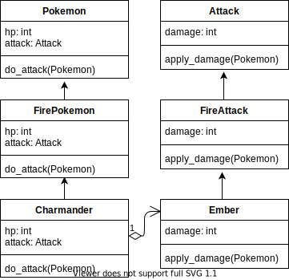

OOP Battle
==========

This project is a Pokemon battle simulator demonstrating OOP principles. There are two base classes with several children as shown in the following UML diagram:



The current implementation is incomplete. You should extend it to include the following:

1. Add a `GrassAttack` class that is a child of `Attack`.
2. Add `VineWhip`, a `GrassAttack` that deals 5 damage.
3. Add `Bulbasaur`, a `GrassPokemon` with 20 HP that uses `VineWhip`.
4. Add `Tackle`, an `Attack` that deals 5 damage.
5. Add `Ratatta`, a `Pokemon` with 16 HP that uses `Tackle`.
6. Adjust `FireAttack` to apply double damage to `GrassPokemon`.
7. Adjust `GrassAttack` to apply double damage to `WaterPokemon`.
8. Add `Charizard`, a `FirePokemon` with 150 HP that uses a new `FireAttack` called `FlameThrower` that deals 60 HP of damage.
9. Add `Venusaur`, a `GrassPokemon` with 225 HP that uses a new `GrassAttack` called `RazorLeaf` that deals 95 HP of damage.

Once these features have been added, all included doctests should pass. These can be executed by running:

```
python3 -m doctest battle.py
```

or simply:

```
make test
```
